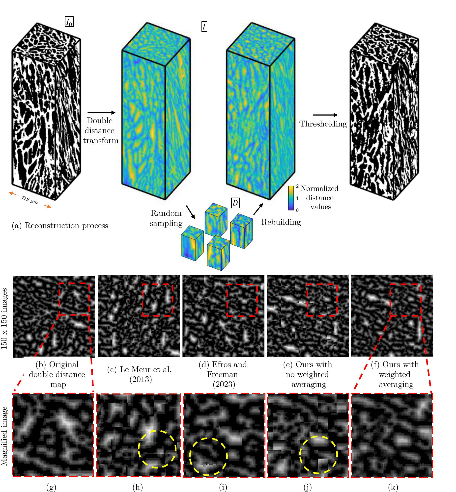
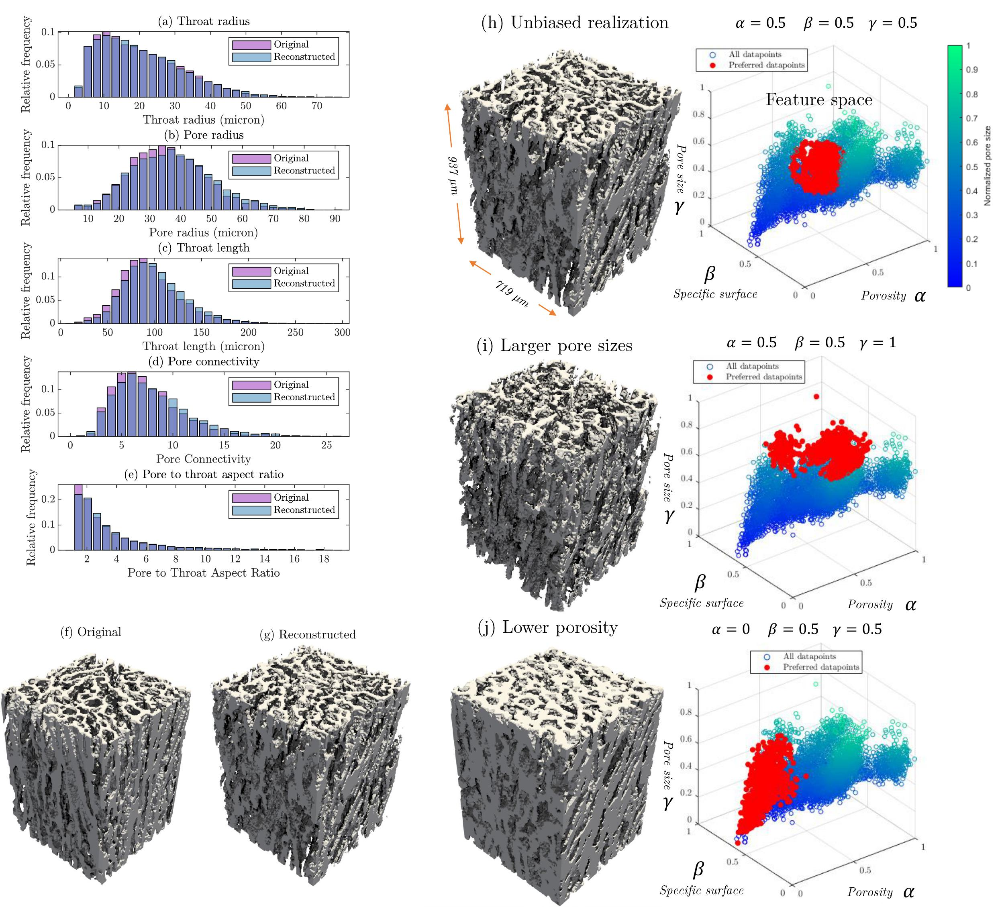

# 3DSYN: 3D Microstructure Image Synthesis

3DSYN is a MATLAB-based tool for synthesizing 3D microstructure images using an adaptive patch-based sampling and reconstruction approach. This repository implements the methodology described in our paper "Structure-property relationships in fibrous meniscal tissue through image-based augmentation", published in Philosophical Transactions of the Royal Society A.
Below is an example of the micros-structered materials that can be generated using this tool. 


## Methodology

### Double Distance Map Transformation


*Figure 1: Schematics of the image reconstruction process, including breaking down the double distance map into small samples and rebuilding by putting them back together in a new order (a), a 2D slice of the double-distanced geometry (b), an examples of 2D reconstruction via Le Meur et al. approach (c), an examples of 2D reconstruction via Efros and Freemain approach (d), ours without weighted averaging (e) and ours with weighted averaging (f). A magnified region (g-k) shows detailed comparison of the reconstruction quality, with yellow dashed circles highlighting areas where discontinuities are visible in existing methods (h,i,j) but are effectively addressed by our weighted averaging approach (k).*

The reconstruction process begins with a double distance map transformation that converts binary images into a more spatially correlated representation. This transformation creates a continuous field where values near 1 indicate proximity to phase interfaces, enabling smoother interpolation between structural features. In the implementation, I₀ represents the binary input image (solid=1, void=0), and d̂ is the normalized Euclidean distance transform.

### Feature-Controlled Synthesis


*Figure 2: Comparison of pore network statistics for the original and an unbiased reconstruction of the tissue sample #1 (a-e), 3D rendering of both geometries (f, g), Unbiased (h), large-pore (i) and low-porosity (j) realizations of tissue sample #1 and their preferred data points in feature space of α (normalized porosity), β (specific surface area), and γ (maximum pore size).*

The synthesis process is controlled by three key parameters:
- α (alpha): Controls porosity
- β (beta): Controls specific surface area
- γ (gamma): Controls pore size

For each new reconstruction, patches are selected based on their position in this 3D feature space, allowing targeted variations while maintaining structural coherence.

## Features

- Adaptive 3D image synthesis for fibrous and porous materials
- Control over key microstructural parameters (porosity, specific surface area, pore size)
- Efficient vectorized patch-based reconstruction algorithm
- Memory-efficient processing of large 3D volumes

## Requirements

- MATLAB R2019b or later
- Image Processing Toolbox
- Statistics and Machine Learning Toolbox

## Installation

1. Clone this repository:
```bash
git clone https://github.com/ArashRabbani/3DSYN.git
```

2. Add the `funcs` directory to your MATLAB path:
```matlab
addpath('funcs');
```

## Main Function: TDSYN

The core functionality is implemented in `TDSYN.m`. This function performs 3D synthesis of microstructure images with controlled variations in morphological properties.

### Parameters

- `TargetPorosity` (α): Controls the void fraction (0-1)
- `TargetSurfaceArea` (β): Controls the specific surface area (0-1)
- `TargetPoreSize` (γ): Controls the characteristic pore size (0-1)
- `SampleSize`: Size of sampling window [x,y,z]
- `VolumeSize`: Size of output volume [x,y,z]
- `RotationAngle`: Angle for rotation transformations
- `MemoryAllowed`: Maximum memory allowed in GB
- `InputVolume`: Input 3D binary volume
- `DownsampleFactor`: Factor for downsampling
- `RandomSeed`: Seed for random number generator

### Usage Example

```matlab
params = struct();
params.TargetPorosity = 0.5;
params.TargetSurfaceArea = 0.5;
params.TargetPoreSize = 0.5;
params.SampleSize = [48, 48, 48];
params.VolumeSize = [115, 115, 200];
params.RandomSeed = 42;

reconstructed_volume = TDSYN('InputVolume', input_volume, ...
    'TargetPorosity', params.TargetPorosity, ...
    'TargetSurfaceArea', params.TargetSurfaceArea, ...
    'TargetPoreSize', params.TargetPoreSize, ...
    'SampleSize', params.SampleSize, ...
    'VolumeSize', params.VolumeSize, ...
    'RandomSeed', params.RandomSeed);
```

## Demo Files

### Demo1: Basic Reconstruction
`Demo1.m` demonstrates the basic functionality of 3DSYN by creating different realizations of meniscal tissue with the same target parameters but different random seeds. This helps visualize the stochastic nature of the synthesis process while maintaining consistent structural properties.


Key features:
- Loads sample tissue data
- Performs two reconstructions with different random seeds
- Compares porosity between original and reconstructed volumes
- Visualizes results in a 3-subplot figure

### Demo2: Porosity Control
`Demo2.m` showcases the ability to control porosity through the α parameter. It generates reconstructions with different target porosity values while keeping other parameters constant.

Key features:
- Generates reconstructions with α values of 0.4, 0.5, and 0.6
- Demonstrates the effect of porosity control on final structure
- Calculates and displays actual porosity values

### Demo3: Surface Area Control
`Demo3.m` demonstrates control over specific surface area using the β parameter. This is particularly useful for applications where surface area to volume ratio is critical.

Key features:
- Creates reconstructions with β values of 0.4, 0.5, and 0.6
- Calculates surface area using perimeter analysis
- Visualizes the effect of β on surface characteristics

### Demo4: Pore Size Control
`Demo4.m` shows how to control pore size distribution using the γ parameter, which is important for applications where pore size affects material properties.

Key features:
- Generates reconstructions with γ values of 0.4, 0.5, and 0.6
- Calculates maximum pore size using distance transform
- Visualizes the effect of γ on pore structure


## Support Functions

The `funcs` directory contains essential support functions:
- `surfacex.m`: 3D visualization utility
- `plotcube.m`: Helper function for plotting cubes

## Citation

If you use this code in your research, please cite our paper:

```bibtex
@article{rabbani2025structure,
    title={Structure-property relationships in fibrous meniscal tissue through image-based augmentation},
    author={Rabbani, Arash and Sadeghkhani, Ali and Holland, Andrew and Besharat, Mohsen and Fang, Han and Babaei, Masoud and Barrera, Olga},
    journal={Philosophical Transactions of the Royal Society A},
    year={2025}
}
```

## License

This project is licensed under CC BY-NC 4.0 - see the [LICENSE](LICENSE) file for details

## AI Assistance Disclosure
This repository's documentation and code have been enhanced with the assistance of AI tools. Specifically:
- Documentation preparation was aided by AI language models
- Code formatting and style improvements were made with AI assistance
- The core algorithms and implementation remain original work


## Contact

For questions and support, please contact:
- Arash Rabbani (a.rabbani@leeds.ac.uk) 
